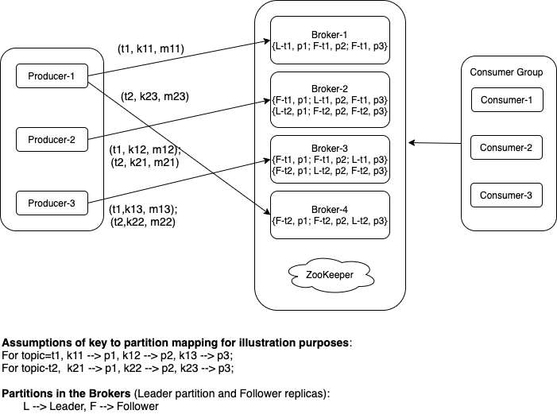

#### Design a Distributed Message Bus System (Kafka)

##### Requirements:
`Functional Requirements`:  
- Senders are able to sender messages to the message bus.
- Consumers are able to retrieve the messages.
- Messages maintain some sort of order.

`Non Functional Requirements`:
- Highly available
- Highly durable once acknowledged
- Highly scalable
  - Number of message types
  - Number of messages per type
- Low latency writes and reads

Kafka is a highly reliable, scalable, durable, decoupled, publish/subscribe and low latency distributed message bus system. 
We will discuss the design aspects of Kafka in this page.

`Scope of this page`: Though Kafka has evolved into a full-fledged event streaming platform, this page focuses on the functionality of a Message Bus platform.

Some basic terminologies wil make it easier to decribe a Kafka Cluster.  

It will be useful to define some basic terms making it easier to discuss Kafka platform.

##### `Basic Terminologies`:  

###### `Producers, Consumers and Kafka Cluster (Message bus)`:
- Producers: Producer applications publish/write message to Kafka message bus system.  
- Consumers: Consumer applications subscribe and read messages from Kafka message bus system.  
- Kafka Cluster: A Kafka cluster is a self-sufficient platform delivering message bus service. It is discussed in more details subsequently.  

###### `Topics and Partitions`:
- `Topics`: Topics define categories of messages. One can visualize the topics similar to folders in a filesystem. 
  - Topic is a unit of scale in Kafka. Topics are served by separte physical servers enabling the customers to scale the message bus.
- `Partitions`: The messages for a Kafka topic is stored in one or more partitions. 
  - Each partition runs on separate CPU/Memory/storage space and hence provides an unit of scale for a topic.  

#### `A basic System Diagram`:

The diagram illustrates a Kafka cluster with a configuration of  
- Four brokers,  
- Two topics, with with three partitions each and 
- each partition with a replication factor of three.  
And the Kafka cluster is serving three producers and three consumers.

##### `Kafka Cluster Components`:
`Brokers`:
A kafka cluster consists of a set of brokers. Brokers seliver multiple functionality.
- Bootstrap Server Functionality:
  - Each broker can provide bootstrap functionality.
  - Only a small subset of broker endpoints are dvertised as bootstrap server endpoints. 
  - Bootstrap service provides the clients with 
    - endpoints for the brokers for specific topics
    - functionality of topic management, e.g., create/delete topics.
- Partition Message Service:
  - For each topic/partition, there is one leader broker and zero or more follower brokers. 
  - The clients can only write to or read from the leader broker for a topic/partition.
  - The follower broker replicate the partition messages to their local stores and could act as the leader in case the leader is inaccessible.
  - Futhre details are described below.
`ZooKeeper`:
  - Kafka uses ZooKeeper as the distributed configuration service.
  - Zookeeper is used to monitor node availability amongst other functionality. 
  - Further details are described in subsequent sections.

The subsequent sections discuss various aspects of Kafka configuration and operations in the form of a set of questions and answers.

`Basic Concepts`:
- How does a client (producer/consumer) find out which broker to access for publishing/consuming the messages?
  - As you might have observed, there is no load balancer in the basic system diagram above for distribution of traffic. A client, through Kafka client library, sends messages directly to a specific broker.
  - Kafka provides abilities to distribute messages among multiple partitions for a topic.
  - Kafka client library provides the following logic for distributing messages amongst the brokers for a topic.
    - Step-1: Contact a Bootstrap server and get the list of broker endpoints for a topic.
      - Kafka requires that a subset of broker endpoints are advertised as Bootstrap servers for fetching the topic/partition endpoint list.
    - Step-2: When a message is published, it generates murmur2 hash of the message key and does a mod with the # of partitions in the topic finding the broker id.
    - Step-3: Sends the message <k,v> to the broker endpoint identified by broker id.
    - Note that this is very basic explanation. There are advanced functionality available and they are discussed subsequently. 
- What is the role of ZooKeeper in a Kafka Cluster?
  - Kafka makes use of ZooKeeper's configuration service for a Kafka cluster. 
  - Although, many of the cluster administrative tasks are performed by Controlloer broker, controller broker depends on Zookeeper for monitoring the health of al the brokers in a cluster.
- What are the topics and how they are used?
  - A topic defines a category of messages.
  - This is a unit of scale in Kafka in that one can increase the over all throughput of the system by increasing the number of topics and adding servers serving teh topics.
  - Some examples: Customers, Orders, user-signups, user-activities, etc. Each of these message types can indenependtly scale as they are served by separate servers.
- What are Partitions and how are they used?
  - Partitions provide further unit of scale for a topic. 
  - A topic can be partitioned to have multiple partitions. Each partition can be served by separate physical servers scaling the topic throughput.
  - Thus, partitions allow further scaling of the throughput per topic. 
- How are the server resources efficiently utilized, since the throughput requirements of topics may vary greatly?
  - Good question. Kafka is well designed for efficient resource utilization. 
  - Each broker can be configured to serve  N partitions, either as a leader of followers. 
  - That provides great flexibility to confure a broker to be efficiently utilized. 
- Is Kafka highly available?
  - Yes, it delivers high availability by providing the functionality of maintaining one or more replicas per partition. 
  - Kafka replicates each partition to a set of separate services based on configurable replication factor.
- What are Kafka's delivery semantics?
  - In any distributed system, there is a trade off between durability and latency.
    - Kafka provides three forms of delivery semantics for users to choose from based on the business requirements. The delivery semantics is set per topic.
    - At most Once: Messages can be lost, but never redelivered.
      - The scenario occurs with configuration: request.required.acks = 0
    - At least Once: Messages are not lost, but may be delivered more than once.
      - The scenario occurs with configuration: request.required.acks = 1
    - Exactly Once: Messages are not lost and are delivered exactly once.
      - The scenario occurs with configuration: request.required.acks = ALL
      - TODO: This is a complex topic. Paraphrase the functionality succintly and include description of how it is acheved through Kafka transactional messaging.
- How does message ordering work in Kafka?
  - Kafka delivers message order per partition.
  - So, the messages in a topic are not ordered across the partitions.
  - Since kafka provides the functionality of storing all messages for a certain key in teh same partition, message ordering within a partition solves the ordering requirements for many use cases.
- How does Replication work in Kafka?
  - Kafka replicates the partitions based on the configured replication factor and it is configured per topic.
  - A partition has a single leader and zero or more followers. Kafka follows a active/passive model in that producers can write only to the leader and consumers can read only from the leader. 
  - In the case of the leader failure for a topic/partition, a new leader is selected by controller broker for its followers.
  - The selection criterion uses a concept of in-sync replica set and that is described in details subsequently.
- What is in-sync replica?
  - There are many good posts on Kafka's decision to use in-sync replica method for delivering high availability.
  - In summary, there are few methods of implementing high availability.
    - Quorum Writes/reads:
      - If there are N replicas, in order to guarantee data consistency, W (write successul nodes) + R (Read match nodes) > N (total number fo recplicas)
    - Majority Writes
      - In this method, a write is deemed successful when write succeeds with majority of nodes.
        - In a three node cluster, two writes succeed.
        - In a five node cluster, three writes succeed.
      - So, from fault tolerance standpoint, a 3-node cluster can survive a single node failure and a 5-node cluster can survive two nodes failure.
    - In-sync Replicas:
      - Leader broker for a partition keeps track of in-synce replicas for the partition.
      - In order to remain in in-sync replica list,
        - The follower broker must have fetched all the messages up to log end offset in last X seconds (replica.lag.time.max.ms). 
        - The follower broker must have sent heartbeat to ZooKeeper in last X seconds (zookeeper.session.timeout.ms).
      - In case of leader failure, controller broker selects a leader for its in-sync replica set.
      - TODO: Write a separate section on this topic.
- How does Kafka store the messages?
  - TODO: Describe writes: log an dindes files, append-only, batching, in same format as producer sends for effieienct reads
  - TODO: Describe reads: sendfile() system call and how Kafka achieves zero-copy reads
  - TODO: Describe compactions maintaining most recent value for the keys

`Advanced Concepts - TODO`: 
- Describe consumer group and read scaling
- Describe consumer offset management
- Fault tolerance with rack-aware placements
- Discuss Exactly Once Semantics
- Multi data-center replications
- Streams API providing higher level consumer API relative to consumer group based API     
- Describe Kafka Connect 
- Discuss Change Data Capture (CDC)
