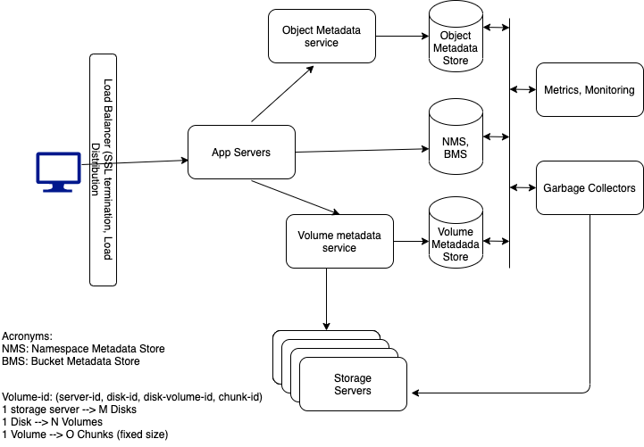
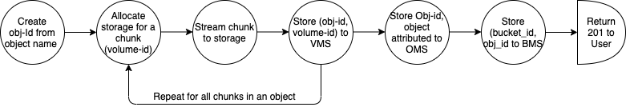
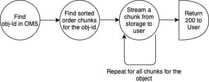

### Design a Cloud Native Object Storage Service

`What is an Object Storage Service`?  
Object storage service  is a computer data storage architecture that manages data as objects as opposed to other architectures like file system  where the data are managed as a file hierarchy.  

Before discussing the requirements, it might be easier to document some some basic terminoligies used in the context of object storage. 

`Some Basic Terminologies`:
- Namespace: Namespace is a container, bgenerally, one per customer account.  This is similar in concept to a file system in a computer.
- Buckets: Buckets are containers within a namespace and they contain data as objects. You can visualize them as folders in a file system.  
- Objects: Obejcts are units of data storage. Users store data files, images, etc. as objects in a bucket.
- URI: A network path identifier for a resource. It generally takes the form of https://<domain-name>/<namespace>/<bucket-name>/<object-name> 
  - An Example of an object URI: https://bast-object-storage.com/acme/demo-bucket/README.md

`Functional Requirements`:
- Users are able to 
  - create/delete/list buckets.
  - create/delete/read objects.
  - create/delete/read mault-part objects (generally opted for very large files and/or higher throughput)

`Non-Functional Requirements`:
- Highly scalable
  - In terms of data storage; Possibly multi exabytes or more.
  - In terms of # of namespacs, buckets and particularly objects. Generally in bilions of objects.
- Highly performant:
  - High aggregate throughput
  - reasonably low latency
- Highly durable: Once data write is acknowledged, the system must not lose data.
- Highly Available: Data are highly available in the presence of node failures or network partitions.

`Out-of-scope`:
- This page focuses on core functionality. A subsequent page will elaborate on the remaining functionality.

## High Level System Design:

The above diagram is a high level diagram with a set of key components that are part of an object storage service.

`Components`:
- Load Balancer: It distributes the work load among a set of application servers. In addition, it also implements SSL termination, API rate limiting etc.
- Application server: Application server implements the workflows for CRUD operations of various resources on behalf of the users with the help of 'Volume service' and 'Object Service' as described in the sections below.
- Volume Service: This provides data storage allocation service. It also inteacts with replications service for data replication for fault tolerance.
- Object Service: This provides the metadata services for namespaces, buckets and objects.
- Garbage Collector: As objects get deleted or edited, staorage used by these objects are to be reused. Garbage collector reclaims the freed up storage so that new objects can be written to these freed up locations. This requires some dat arelocations, free list management etc.  
- Monitoring and Metrics: Monitoring and metrics service listens to the user and service events and enables the developers finding system bottlenecks, user behavior etc. so that syste can be optimized/improved serving the users better. This may include event data processing, analysis.  

`Metadata Stores`:  
Namespace Metadata Store (**NMS**) - Stores namespaces and related user info.  
Bucket Metadata Store (**BMS**) - Bucket metadata store  
Object Metadata Store (**OMS**) - Stores Object information  
Volume Metadata Store (**VMS**) - Stored volume (storage) info. for the objects.  
Note: NMS and BMS are not discussed in this design discussion. The design will be extended for these in subsequent sections.  

`Write Object Flow`:

- Generate an object-id hash for the object name
  - object-name used: /namespace/bucket/object-name
  - The whole path is used for uniquely identify an object. This avoids the collission when object names are same in different buckets or accounts.
- Allocate a volume-id for a chunk (fixed size).
- Stream chunk data up to the chunk size to storage based on volume-id.
  - Note that the data size may be smaller that the chunk size. So, the data-chunk-size is stored as part of metadata so that the correct amount of data from a chunk will be returned to the user on a read.
  - Store (object-id, volume-id, chunk-number, data-chunk-size, checksum) in volume metadata store
- Calculate a running md5 of the data stream.
- Repeat this process until all chunks of the entire object is uploaded and stored.
- Write object record to object metadata store (object-id, object-size, object-md5, timestamp etc.)
- Write a record to BMS (bucket-id, object-id)
- Acknowledge to the user with 201 status.

`Example of metadata records for a two-chunk object write`: 

VMS (object-id, volume-id, chunk-number, data-size, cehcksum): (obj1, v1, 0, size, checksum-0), (obj1, v2, 1, size, checksum-1)  
TODO: Elaborate on volume-id, e.g, server-id, disk-id, disk-volume-id, disk-chunk-id.   
OMS(object-id, object-size, timestamp, md5-hash): (obj1, obj-size, timestamp, md5-hash)  
BMS: (bucket1, obj1)  

`Read Object Workflow`:  

- Find object record in OMS for object name.  
- If not found, return 404.  
- Read sorted chunk list from VMS for the object-id.  
- Stream data to the user in chunk sorted order from the storage.  
- return 200

`Multi-part Write`:   
- Multi-part writes are used for improving aggregate throughput through mutiple parallel streams.  
- Multi-part writes are aslo used when the object is very large.    
- The above flow remains and is repeated for each part.  
- Part number is persisted in VMS in chunk records.  
- OMS will have a commit record per part and a commit record for overall object. md5 in overall object will be md5 or md5s of the parts.  

`Multi-part Read`:
- Multi-part read leverage single-part read flow, as described above, and iterates through the list of sorted parts sending data for the entire object to the user.

##### `Storage Considerations`:  

Storage Considerations  
- Data Storage:   
- Block volumes in commodity servers. 
- We should be able to add servers linearly scaling the data store.  
- Writes are sequential on first pass.  

- Metadata Storage Options: Two options:  
  - A sharded, replicated, consistent hash based NOSQL datastore, e.g., Cassandra or similar database.  
  - A Sharded, replicated, consistent-hash based (key generation) SQL database may also be an option.  
  - Both solutions would deliver high read throughput, and the choice would depend on teh expertise available with a company.   
  - SQL based solutions would be generally more complex in general to maintain, scale and rebalance the shards over time.  

Storage Scalability:  
- Data store is linearly scaled by adding more storage servers with storage.  
- Metadata store are scaled by adding storage nodes to a consistent-hashing based system and rebalancing the hash range among the adjacent nodes.  

Storage High Availability and Durability:  
- All the data and metadata are replicated.   
- Geo replication needs to be considered for addressing disaster recoveries.  
- There is generally a durability vs. latency tradeoff and durability should be of priority over latency.  
- Synchronous replications needs to be considered across geo locations.  

Scale Considerations:  
- Application servers: Application server count can be increased when there is a need to service increasing number of users.  
- Metadata Servers: Each of the metadata stores can be scaled out by adding new nodes in case of NOSQL. For SQL, we may need to add more readers or add write/read cluster and reshard/rebalance the metadata storage.  
- Data Service: When more data are needed to be stored, we can add storage servers and that should linearly increase storage space without any throughput/latency degradations.  

Performance Considerations:  
- Both Data and emtadata store should provide high throughput and low latency.  
- Implement append only writes. So, an edit translates to a delete+new-object-write.  
- There are opportunity for 
  - read-ahead, 
  - SSD tier usage for hot data, and HDD  for warm/cold data (time-based and/or usage based)  

Storage Optimization:  
- Perform garbage collection of deleted, uncommitted storage or edited objects and free up disk space for reusage.  

Durability Considerations:  
- Implement data replication. Geo distributed data replication addresses the disaster recovery use cases, but it comes with a latency penalty. A combination of synchronous replication and geo-distributed asynchronous replications might be a feasible option. But, in generall, durability is a hard requirement and must be addressed.  
- Implement metada replication. Based on NOSQL or SQL implementation, each provides methods for data replication.  
- Implement bit rot protection with periodic reads and repair through relocation in case of bit rots on the disks.   
